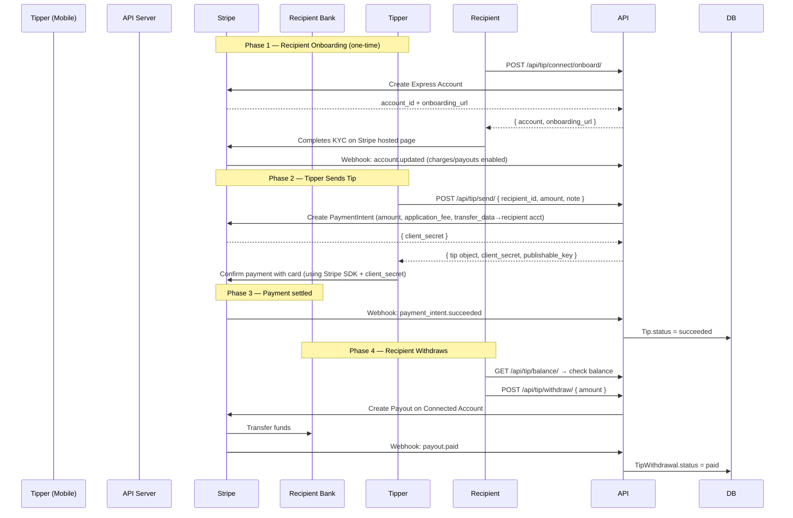

# PetNabor — Tip System Documentation

## Overview

The Tip System allows users to send peer-to-peer monetary tips after a meeting. It is built on **Stripe Connect** (Express accounts) so that recipients receive funds directly into their bank account.

---

## Architecture & Flow



---

## Database Models

### `TipSettings` (Singleton)
Admin-configurable global settings. Always a single row, accessed via `TipSettings.get_instance()`.

| Field | Type | Default | Description |
|---|---|---|---|
| `commission_percentage` | Decimal | `20.00` | % the platform keeps from each tip |
| `minimum_tip_amount` | Decimal | `1.00` | Minimum tip in USD |
| `maximum_tip_amount` | Decimal | `500.00` | Maximum tip in USD |
| `minimum_withdrawal_amount` | Decimal | `10.00` | Minimum payout in USD |

---

### `StripeConnectAccount`
One-to-one with `User`. Tracks the user's Stripe Express account.

| Field | Description |
|---|---|
| `stripe_account_id` | Stripe account ID (`acct_xxx`) |
| `is_onboarding_complete` | True once KYC is done |
| `is_charges_enabled` | Stripe confirms charges allowed |
| `is_payouts_enabled` | Stripe confirms payouts allowed |
| `is_fully_verified` | All three flags are `True` (computed property) |

> [!IMPORTANT]
> A recipient **must** have `is_fully_verified = True` before anyone can tip them.

---

### `Tip`
One record per tip transaction.

| Field | Description |
|---|---|
| `tipper` | FK → User who sent the tip |
| `recipient` | FK → User who received the tip |
| `meeting` | FK → Meeting (optional) |
| `amount` | Total charged to tipper (USD) |
| `commission_percentage` | Snapshot of rate at tip time |
| `commission_amount` | Platform's cut |
| `recipient_amount` | `amount − commission_amount` |
| `stripe_payment_intent_id` | Stripe PI ID |
| `stripe_charge_id` | Populated after payment succeeds |
| `status` | `pending` → `succeeded / failed / refunded / cancelled` |
| `note` | Optional message from tipper (max 500 chars) |

**Commission formula:**
```
commission_amount = round(amount × commission_percentage / 100, 2)
recipient_amount  = amount − commission_amount
```

---

### `TipWithdrawal`
One record per payout request.

| Field | Description |
|---|---|
| `user` | FK → User requesting the payout |
| `connect_account` | FK → StripeConnectAccount |
| `amount` | Requested payout amount (USD) |
| `stripe_payout_id` | Stripe Payout ID (`po_xxx`) |
| `status` | `pending` → `paid / failed / cancelled` |
| `failure_message` | Set if Stripe payout fails |

---

## API Endpoints

Base path: `/api/tip/`
Authentication: **Bearer token** (except the webhook).

---

### Stripe Connect

#### `POST /api/tip/connect/onboard/`
Creates a Stripe Express account and returns an onboarding URL. Idempotent — calling again returns a fresh URL for the existing account.

**Response `200`:**
```json
{
  "account": {
    "stripe_account_id": "acct_1ABC",
    "is_onboarding_complete": false,
    "is_charges_enabled": false,
    "is_payouts_enabled": false,
    "is_fully_verified": false,
    "created_at": "2024-01-01T10:00:00Z",
    "updated_at": "2024-01-01T10:00:00Z"
  },
  "onboarding_url": "https://connect.stripe.com/setup/e/..."
}
```

> [!TIP]
> Mobile app should open `onboarding_url` in an in-app browser. Once the user completes the flow, Stripe calls the webhook automatically — you don't need to poll.

---

#### `GET /api/tip/connect/status/`
Fetches live status from Stripe and syncs it to the database.

**Response `200`:** Same `StripeConnectAccount` object as above.  
**Response `404`:** No connect account found.

---

### Tipping

#### `POST /api/tip/send/`
Creates a `PaymentIntent` and pending `Tip` record.

**Request body:**
```json
{
  "recipient_id": "550e8400-e29b-41d4-a716-446655440000",
  "meeting_id": "550e8400-e29b-41d4-a716-446655440001",
  "amount": "15.00",
  "note": "Thanks for your time!"
}
```

| Field | Required | Notes |
|---|---|---|
| `recipient_id` | ✅ | UUID of the user to tip |
| `meeting_id` | ❌ | UUID of the associated meeting |
| `amount` | ✅ | Between `min` and `max` tip amounts |
| `note` | ❌ | Max 500 characters |

**Response `201`:**
```json
{
  "tip": { ... },
  "client_secret": "pi_xxx_secret_xxx",
  "publishable_key": "pk_live_xxx"
}
```

> [!IMPORTANT]
> After receiving `client_secret`, the **mobile app** must call `stripe.confirmPayment()` (or platform equivalent) using the Stripe SDK. The server only creates the intent — actual charge happens client-side.

**Error cases:**
| Status | Reason |
|---|---|
| `400` | Self-tip, amount out of range, recipient not verified |
| `403` | User not a participant in the specified meeting |
| `404` | Recipient or meeting not found |
| `502` | Stripe API error |

---

#### `GET /api/tip/history/`
Returns tip history for the logged-in user.

**Query params:**
| Param | Values | Default |
|---|---|---|
| `direction` | `sent`, `received`, `all` | `all` |
| `status` | `pending`, `succeeded`, `failed`, `refunded`, `cancelled` | all statuses |

**Example:** `GET /api/tip/history/?direction=received&status=succeeded`

---

#### `GET /api/tip/balance/`
Returns the user's withdrawable balance from their Stripe Connected Account.

**Response `200`:**
```json
{
  "available_balance": "42.50",
  "currency": "usd",
  "minimum_withdrawal": "10.00"
}
```

---

#### `GET /api/tip/settings/`
Returns current platform tip configuration (read-only for clients).

**Response `200`:**
```json
{
  "commission_percentage": "20.00",
  "minimum_tip_amount": "1.00",
  "maximum_tip_amount": "500.00",
  "minimum_withdrawal_amount": "10.00"
}
```

---

### Withdrawal

#### `POST /api/tip/withdraw/`
Creates a Stripe Payout from the user's Connected Account to their bank.

**Request body:**
```json
{
  "amount": "25.00"
}
```

**Validations:**
- Must have a fully verified Stripe account
- Amount ≥ `minimum_withdrawal_amount`
- Amount ≤ `available_balance`

**Response `201`:**
```json
{
  "id": "uuid",
  "amount": "25.00",
  "currency": "usd",
  "status": "pending",
  "stripe_payout_id": "po_xxx",
  "failure_message": "",
  "created_at": "...",
  "updated_at": "..."
}
```

---

#### `GET /api/tip/withdraw/history/`
Returns all withdrawal requests for the current user (newest first).

---

### Stripe Webhook

#### `POST /api/tip/webhook/`
**No authentication** — verified via `Stripe-Signature` HMAC header.

| Stripe Event | Action |
|---|---|
| `payment_intent.succeeded` | Tip → `succeeded`, saves `stripe_charge_id` |
| `payment_intent.payment_failed` | Tip → `failed` |
| `payment_intent.canceled` | Tip → `cancelled` |
| `charge.refunded` | Tip → `refunded` |
| `account.updated` | Syncs `StripeConnectAccount` flags |
| `payout.paid` | TipWithdrawal → `paid` |
| `payout.failed` | TipWithdrawal → `failed`, saves `failure_message` |

> [!CAUTION]
> Never expose `STRIPE_WEBHOOK_SECRET` in client code. It lives only in server environment variables.

---

## Status Lifecycle

```
Tip:          PENDING → SUCCEEDED
                      → FAILED
                      → REFUNDED
                      → CANCELLED

Withdrawal:   PENDING → PAID
                      → FAILED
                      → CANCELLED
```

---

## Environment Variables Required

| Variable | Description |
|---|---|
| `STRIPE_SECRET_KEY` | Stripe secret API key (`sk_live_xxx` / `sk_test_xxx`) |
| `STRIPE_PUBLISHABLE_KEY` | Returned to mobile clients for SDK initialization |
| `STRIPE_WEBHOOK_SECRET` | For webhook HMAC verification (`whsec_xxx`) |
| `FRONTEND_BASE_URL` | Used for onboarding redirect URLs |
